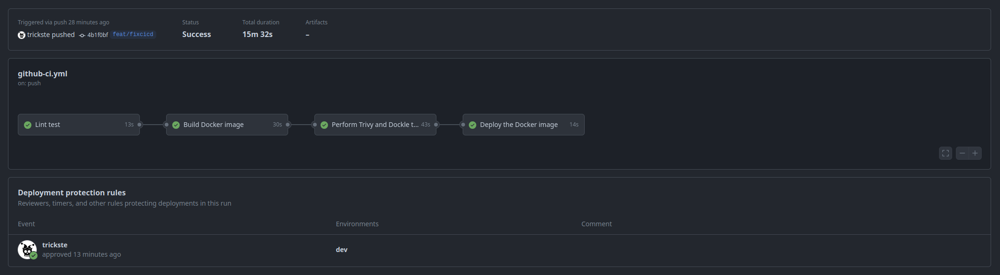

# CSVYAML

## Project Decscription
This repository contains an application that converts between "YAML" and "CSV" file formats. It provides a user-friendly interface for uploading a file, processing it, and downloading the converted file.


## Features
- YAML to CSV Conversion: Upload a YAML file and receive a CSV file.
- CSV to YAML Conversion: Upload a CSV file and receive a YAML file.

## Technology Stack
- Backend: Python with Flask
- Frontend: HTML, CSS
- Containerization: Docker
- CICD: Github Actions

## Key Components
#### csvYaml Module: 
A custom Python module that handles the conversion between YAML and CSV. This module is packaged and used within the application container.

## How It Works
- Upload: Users can upload a YAML or CSV file through the web interface.
- Process: The application processes the uploaded file using the csvYaml module.
- Download: Users can download the converted file from the web interface.

### Application Flow


#### Directory Structure:
```
csvYaml
├── csvYaml
│   ├── csvYaml
│   │   ├── converterFile.py
│   │   └── __init__.py
│   ├── fetchVersion.py
│   ├── main.py
│   ├── setup.py
│   ├── static
│   │   └── css
│   │       └── style.css
│   ├── templates
│   │   └── index.html
│   └── version.txt
├── docker-compose.yaml
├── Dockerfile
└── requirements.txt
```

<!-- ## Application

| Application Name  | Default Port | Language | Description |
| ------------- | ------------- | ------------- | ------------- |
| CSVYAML | 5000 | Python | This is a flask based application that renders a frontend which asks for a file returns the processed file as an interactive link to download output file.  | -->

#### App in idle state:


#### App when file is processed and ready to be downloaded:


### CI/CD Flow

#### CI/CD flow of the application:

#Note: The deployment step waits for manual approval


