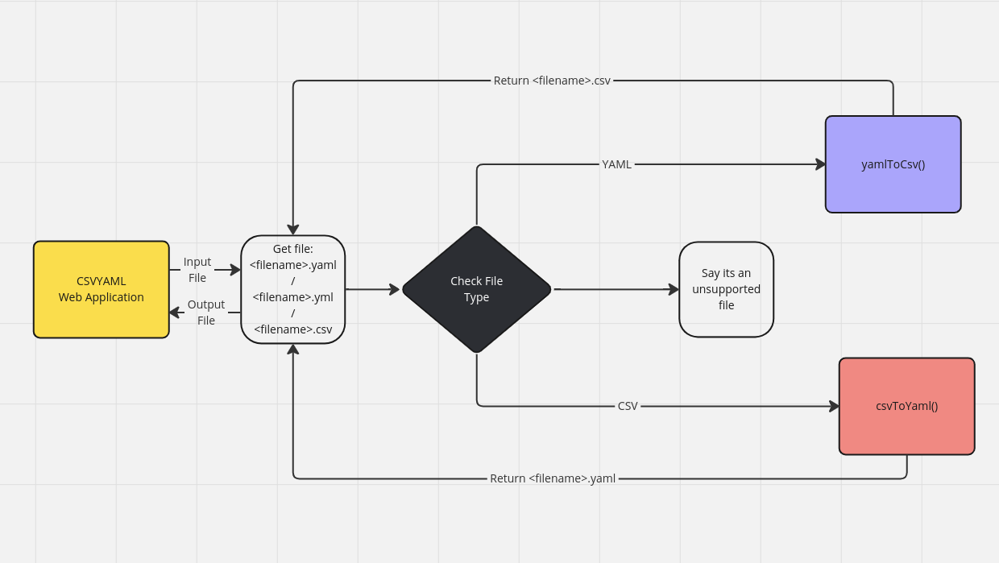
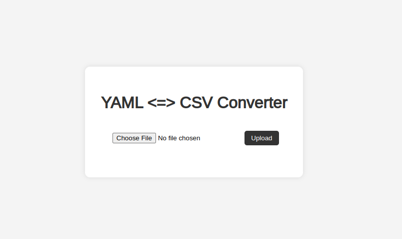
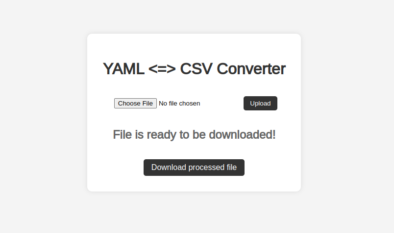
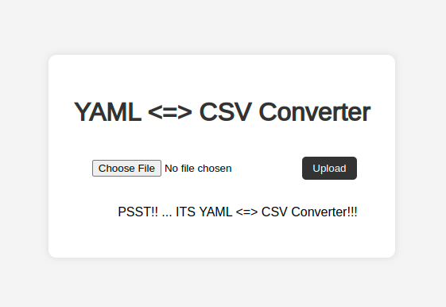
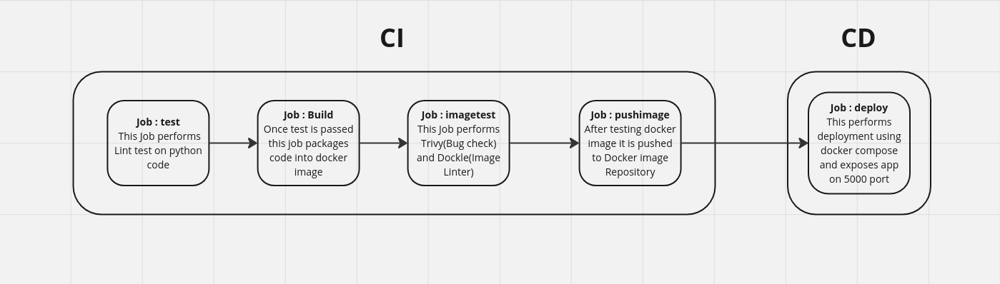
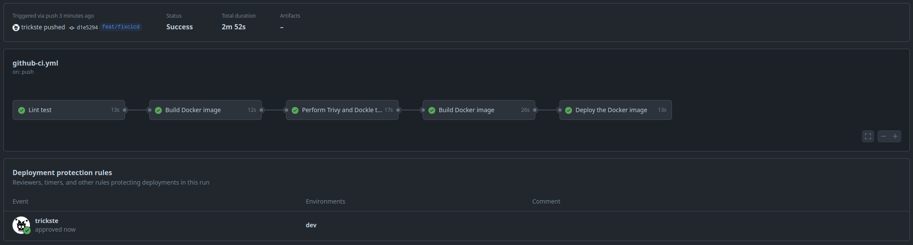

# CSV - YAML

## Project Description
This repository contains a web application that converts between YAML and CSV file formats. It provides a user-friendly interface for uploading a file, processing it, and downloading the converted file.

## Key Components
**csvYaml Module**: A custom Python module that handles the conversion between YAML and CSV. This module is packaged in a wheel file and used within the application container.

## Features
- **YAML to CSV Conversion**: Upload a YAML file and receive a CSV file.
    - The algorithm is able to convert ".yaml" or ".yml" file to ".csv" format.
- **CSV to YAML Conversion**: Upload a CSV file and receive a YAML file.
    - The algorithm is successfully able to convert ".csv" file to ".yaml" format **up to 2 levels**.

## Technology Stack
- **Backend**: Python3 with Flask
- **Frontend**: HTML, CSS
- **Containerization**: Docker
- **CI/CD**: Github Actions

## Python Requirements

| Package | Version | 
| -- | --|
| pandas | 2.2.2 |
| PyYAML | 6.0.1 |
| wheel | 0.43.0 |
| setuptools | 69.5.1 |
| flask | 3.0.3 |
| jinja2 | 3.1.4 |
| markupSafe | 2.1.5 |
| click | 8.1.7 |

## Application Flow


#### Directory Structure:
```
csvYaml
├── csvYaml
│   ├── csvYaml
│   │   ├── converterFile.py
│   │   └── __init__.py
│   ├── fetchVersion.py
│   ├── main.py
│   ├── setup.py
│   ├── static
│   │   └── css
│   │       └── style.css
│   ├── templates
│   │   └── index.html
│   └── version.txt
├── docker-compose.yaml
├── Dockerfile
└── requirements.txt
```

#### How It Works
- **Upload**: Users can upload a YAML or CSV file through the web interface.
- **Process**: The application processes the uploaded file using the csvYaml module.
- **Download**: Users can download the converted file from the web interface.
- **File Format Supported**: .yaml, .yml and .csv

#### App in idle state:


#### App when file is processed and ready to be downloaded:


#### App when file is file uploaded is of wrong extension:


#### csvYaml module usage
```
from csvYaml import converter

output_file = converter(input_file, output_file_directory)

```

## Conversion Example
YAML to CSV : [yamlFile.csv](https://drive.google.com/file/d/1IrLk_TMGDR6hnkMUr0dJr77qOvetve1T/view?usp=sharing) => [yamlFile.csv](https://drive.google.com/file/d/1zyFa64o1pkUVE-fQGR9P_gkgTAhxrgTZ/view?usp=sharing)

CSV to YAML: [csvFile.csv](https://drive.google.com/file/d/1fET8jULu2Ow63_LCwxxgc72AlmNCzhK9/view?usp=sharing) => [csvFile.yaml](https://drive.google.com/file/d/18bLp37T-jMvvG9WGjjO8_CH-FGK7-Gr7/view?usp=sharing)

## CI/CD Flow

#### CI/CD flow of the application:


#### CI/CD Github Actions Screenshot


#### How to use CI/CD file
- Create the application as per the directory structure
- the CI/CD is configured to be invoked on every and pull request on the main branch.
- On invoking the pipeline the folloinng steps will take place
    - **Test Job**: It performs linting test on the python scripts.
    - **Build Job**: It containerizes the application and the **csvYaml** module. 
    - **Image Test Job**: It performs Trivy and Dockle tests on the docker image. Here, we are not using the tests on docker image as quality gates. 
    - **Image Push Job**: Here, the image is pushed to [Dockerhub](https://hub.docker.com/repository/docker/tricksterepo/pythontestapp/general) 
    - **Deploy Job**: Finally the Web app is deployed in my local system as a docker container.


#### Note: 
- The pipeline waits for manual approval to perform CD.
- GitHub Runners are installed on my local machine to run the pipeline.
- The Docker container for the application is deployed on my local machine.
- Dockerfile functioning:
    - **Stage one**:
        - This stage installs the requirements in a venv
        - Then creates the wheel file using command `python3 setup.py bdist_wheel`, here:
            - **setup.py** is the file typically contains metadata about the project and instructions on how to install the package, its dependencies, and other necessary information.
            - **bdist_wheel** command creates a binary distribution in form of a "wheel" file.
    - **Stage Two**:
        - Copies requirements and wheel dictribution file from the previous stage
        - Copies the Web app files from local machine.
        - Invokes the application

## Roadmap
- Implement a system for automatic version upgrades to ensure consistent versioning.
- Set up quality gates for PyLint, Trivy, and Dockle tests to enforce code quality and security.
- Enhance CSV to YAML conversion to support nested structures of arbitrary depth.
- Refactor CI/CD pipeline to be more modular and scalable across different environments.
- Add health checks to monitor the application's status and ensure it is running correctly.
- Update Dockerfile to follow best practices for security and reduce the attack surface.
- Update for deploying the application to cloud platforms like AWS, Azure, and Google Cloud.
